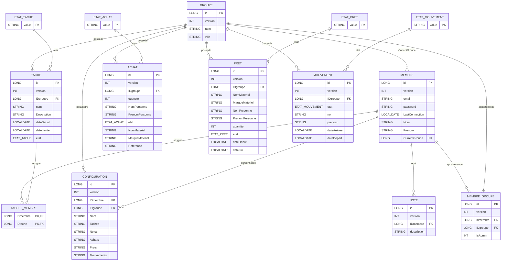

# Diagramme UML/ER - BD actuelle

## Valeurs d'enum (code actuel)

- EtatTache: `à_FAIRE`, `EN_COURS`, `TERMINé`
- EtatAchat: `à_ACHETER`, `COMMANDé`, `REçU`
- EtatPret: `EN_COURS`, `RENDU`, `EN_RETARD`
- EtatMouvement: `STAGE`, `DéPART`, `ARRIVéE`
